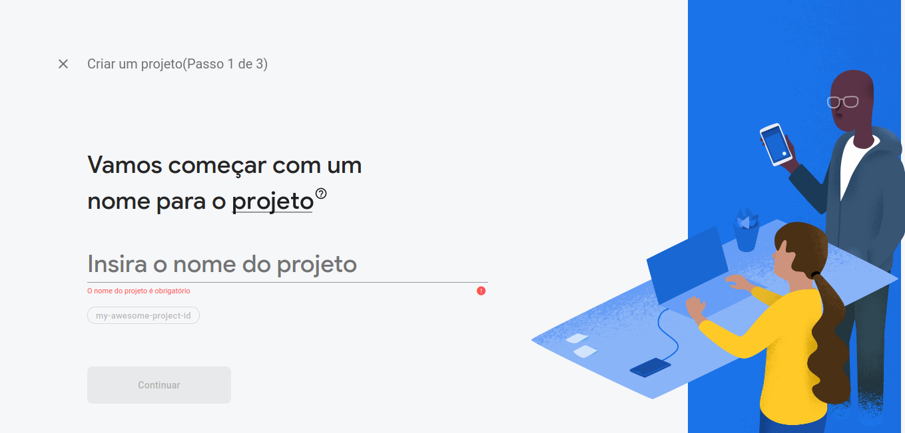
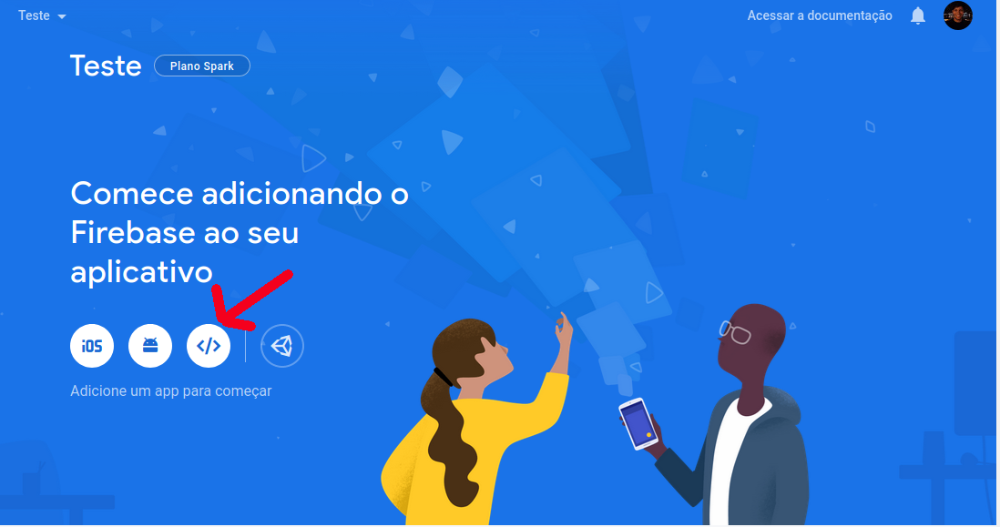
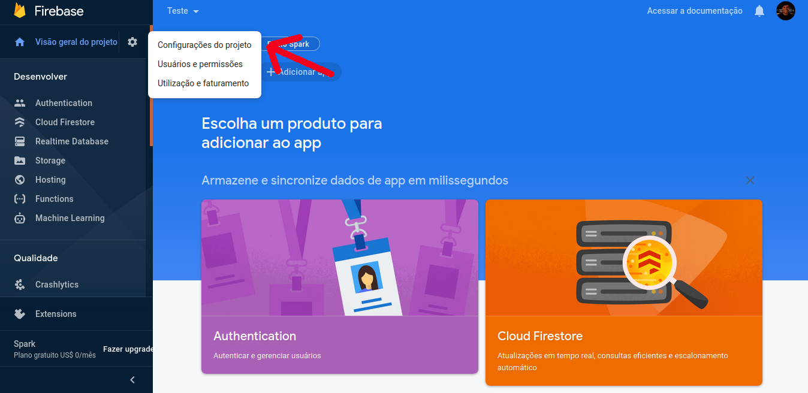
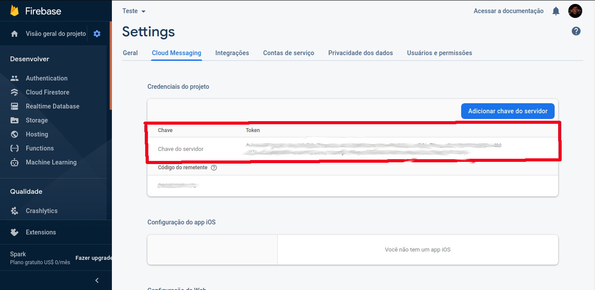

# Sistema de Gestão Energética da Universidade de Brasília - SIGE

## About

The Energy Management System (Sistema de Gestão Energética SIGE-UnB) developed by Univerity of Brasilia (Brazil) in partnership with CEB (Companhia Energética de Brasília), is a web application developed to assist in the monitoring and management of Universidade de Brasília's power consumption and distribution.

The idea is to monitor, collect and display data of each campus power supply, allowing a much better comprehension of the usage patterns and energy quality received from the distribution station.

The system is divided into four main layers:

- the **web presentation layer**, which holds the front-end of the application, including the dashboard for researchers.
- the **mobile presentation layer**, which holds the PWA mobile version of the front-end of the application.
- the **master server** layer, which is responsible for all the data management, data processing, and database redundancy.
- the **slave server** layer is responsible for the communication with energy transductors and data collection.

This reposotory holds the source code for the **master server** layer.

## License

All SIGE source code is licensed under [GPL v3](https://gitlab.com/lappis-unb/projects/SMI/smi-front/-/blob/development/LICENSE)

## Installation

### Docker

First install Docker following the instructions according to your Operational System, [here](https://docs.docker.com/install/).

### Docker Compose

After installing Docker, you can install Docker-Compose, also according to your Operational System [here](https://docs.docker.com/compose/install/).

### Runnning SMI Master

If you have already lifted up [SMI Slave's API](https://gitlab.com/lappis-unb/projects/SMI/smi-slave). All you have to do is:

``` bash
sudo docker-compose up
```

If you haven't you must create the docker network needed for Master to connect. As:

``` bash
sudo docker network create smi-network
```

and you can lift up you Master environment with:

``` bash
sudo docker-compose up
```

And, that's it! You have SMI up and running!

### Running SMI Master Using Make

To simplify the commands you can use make to run the application. You can lift up you Master environment with:

``` bash
sudo make up
```

**obs:** This command creates the smi network if it doesn't exist yet.

#### Other commands

``` bash
sudo make stop # stop all Master containers
sudo make down # down all Master containers
sudo make dump # generate a dump with the saved data
sudo make loaddump # restore dumped data to dump-db.json file
sudo make fixhstore # fix hstore error
```

### Register a slave server

You may register a slave server by sending a POST to '/slave/' ([shortcut](http://localhost:8001/slave/)).

If you are running a slave server on the same machine you are running master, you can find the IP address on the slave container by typing:

``` bash
sudo docker inspect slave-api
```

### Creating a transductor

You may create a transductor by sending a POST to '/energy_transductors/' ([shortcut](http://localhost:8001/energy_transductors/)).

A created transductor is only registred locally on master server, for registering it to a slave server, POST to '/energy_transductors/(transductor's serial number)/add_to_server/' and the post's body must contain { "slave_id" : (target slave id) }.

### Send push notifications 

#### 1. Create a firebase project: 
***If you already have an project then you can skip this step***

After sign into your firebase console, follow the steps to create a new project.



Add an app to our firebase project 



After finished steps to add a project, go to configurations.



At this point we'll need to get our server key to send push notifcations to this app



Finally put the server key in [dev-env](https://gitlab.com/lappis-unb/projects/SMI/smi-master/-/blob/development/dev-env)
as API_KEY. at this moment we already can send push notifications to our app!

* We use [firebase topics](https://firebase.google.com/docs/cloud-messaging/android/topic-messaging), to manage who will reaceive notifcation, Our group should the same of client.